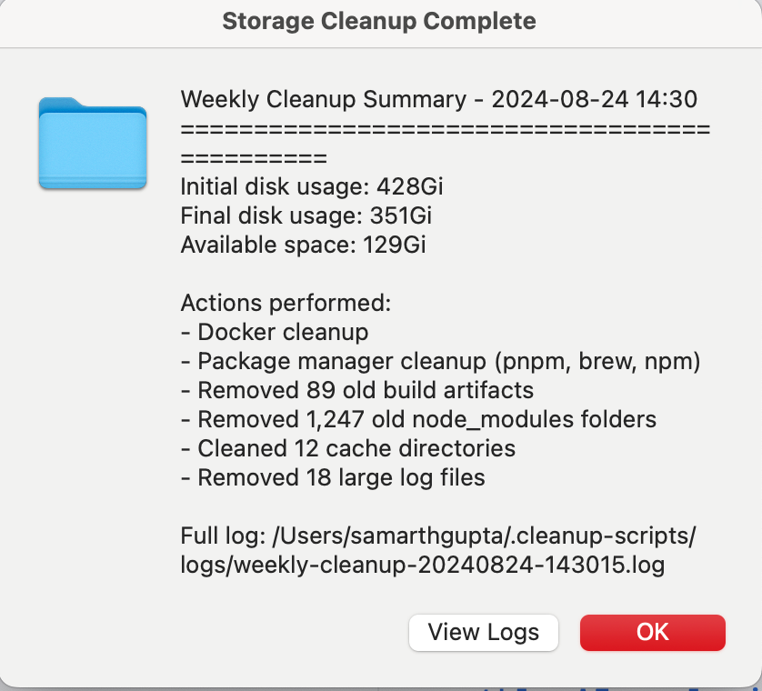
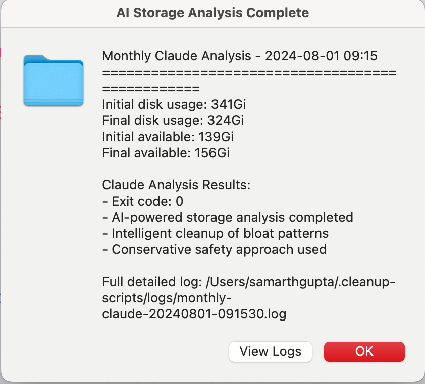

# 🧹 SmartJanitor

> **Your automated cleanup crew for modern MacBooks**

Never see "Your startup disk is almost full" again. SmartJanitor is the set-and-forget solution that keeps your Mac spotless without lifting a finger.

## ✨ What Your Janitor Does

- 🤖 **AI-Enhanced Cleaning** - Claude Code integration for intelligent deep cleaning
- 🗓️ **Smart Scheduling** - Works even when your Mac is napping
- 🛡️ **Ultra Safe** - Only touches the digital dust, never your precious files
- 📱 **Progress Reports** - Get notified when the cleaning crew finishes
- ⚡ **Dual Approach** - Quick weekly tidying + thorough monthly deep cleans
- 🔄 **Zero Interruption** - Cleans while you sleep, work, or binge Netflix

## 🚀 Hire Your Janitor (One Command)

```bash
curl -fsSL https://raw.githubusercontent.com/gupsammy/SmartJanitor/main/install.sh | bash
```

or install locally :

```bash
git clone https://github.com/gupsammy/SmartJanitor.git
cd SmartJanitor
./install.sh
```

The installer will:

- Set up your automated cleaning schedule
- Ask if you want AI-powered deep cleaning
- Configure smart notifications
- Put everything on autopilot

## 📊 What Gets Cleaned

**Your janitor tackles these common messes:**

- 🐳 **Docker Bloat**: 20-50GB (containers, images, build cache)
- 📦 **Package Manager Caches**: 5-20GB (npm, yarn, bun, pnpm, uv, pip, go, brew)
- 🗂️ **Browser Caches**: 2-10GB (Chrome, Safari, Firefox, Edge, Arc, Comet + more)
- 🏗️ **Build Artifacts**: 5-15GB (.next, node_modules, target, dist, build, __pycache__)
- 📝 **Log Spam**: 500MB-2GB (verbose development logs)

**Real cleanup:** One user freed 77GB and found 1,247 forgotten node_modules folders!

## 🧽 Cleaning Schedule

### Weekly Tidy-Up (Sunday 10 AM)

Fast bash-based cleanup of obvious messes:

- Docker system pruning
- Package manager cache clearing
- Old build artifacts removal (>7 days)
- Stale dependencies cleanup (>30 days)
- Large log file disposal

### Monthly Deep Clean (1st of month, 9 AM)

AI-powered thorough analysis:

- Claude Code performs intelligent storage audit
- Identifies new bloat patterns you might miss
- Conservative approach with detailed reasoning
- Catches edge cases that simple scripts miss

### Sleep-Friendly Scheduling

Uses macOS launchd (superior to cron):

- Runs when your Mac wakes up if it missed scheduled time
- No need to keep your laptop plugged in
- Works whether you're present or not

## 🎮 Managing Your Janitor

```bash
# Check what your janitor is up to
smartjanitor status

# Start cleaning right now (test run)
smartjanitor standard

# View cleaning reports
smartjanitor logs

# See upcoming cleaning schedule
smartjanitor schedule

# Unfortunately fire your janitor
smartjanitor uninstall
```

## 🔧 Requirements

- **macOS 14+** (your janitor is picky about cleanliness standards)
- **Homebrew** (optional, for brew cache cleaning)
- **Docker** (optional, for container cleanup)
- **Claude Code** (optional, for AI-powered monthly deep cleans)
  ```bash
  npm install -g @anthropic-ai/claude-code
  ```

## 🛡️ Safety First

**What gets the cleaning treatment:**

- ✅ Package manager caches (npm, yarn, bun, pnpm, uv, pip, go, brew)
- ✅ Browser caches (Chrome, Safari, Firefox, Edge, Arc, Comet, etc.)
- ✅ Build artifacts (.next, dist, build, target, __pycache__ over 7 days old)
- ✅ Stale dependencies (node_modules, vendor over 30 days old)
- ✅ Docker waste (unused images, stopped containers, volumes)
- ✅ Oversized logs (files over 10MB)
- ✅ Temporary system files and application caches

**What never gets touched:**

- ❌ Your documents, photos, music, videos
- ❌ Applications and system files
- ❌ Active projects and recent builds
- ❌ Configuration files and dotfiles
- ❌ Any personal data whatsoever

Your janitor is trained to only clean what's safe to remove.

## 📱 Cleaning Reports

After each session, you'll get interactive notifications:

- **"OK"** dismisses the report
- **"View Logs"** opens detailed cleanup logs in Finder + TextEdit

No more wondering what happened while you were away.

## 🔍 Technical Details

### Architecture

- **Weekly script**: Pure bash for speed and reliability
- **Monthly script**: Claude Code integration for intelligence
- **Scheduling**: macOS launchd for proper sleep/wake handling
- **Logging**: Detailed logs with timestamps and space recovered
- **Notifications**: AppleScript for interactive dialogs

### File Structure

```
~/.smartjanitor/
├── scripts/
│   ├── standard-cleanup.sh      # Fast bash cleanup
│   ├── smart-ai-cleanup.sh      # AI-powered analysis
│   └── send-notification.sh   # Interactive notifications
├── logs/                      # Cleanup logs and summaries
└── manage.sh                  # Main management script
```

## 🤝 Contributing

Contributions welcome! Please read our [Contributing Guide](CONTRIBUTING.md).

### Development Setup

```bash
git clone https://github.com/gupsammy/SmartJanitor.git
cd SmartJanitor
./install.sh --dev
```

## 📸 Screenshots

### Weekly Cleanup Report



### Monthly AI Analysis



## 📜 License

MIT License. Clean code for everyone.

## 🐛 Issues & Support

- **Bug reports:** [GitHub Issues](https://github.com/gupsammy/SmartJanitor/issues)
- **Feature requests:** [Discussions](https://github.com/gupsammy/SmartJanitor/discussions)
- **Security concerns:** [samarthgupta1911@gmail.com](mailto:samarthgupta1911@gmail.com)

## ⭐ Janitor Hall of Fame

[](https://star-history.com/#gupsammy/SmartJanitor&Date)

---

**Built with care by [Samarth Gupta](https://x.com/samarthg1911)**

_Your Mac deserves a professional cleaning service._ 🧹✨
